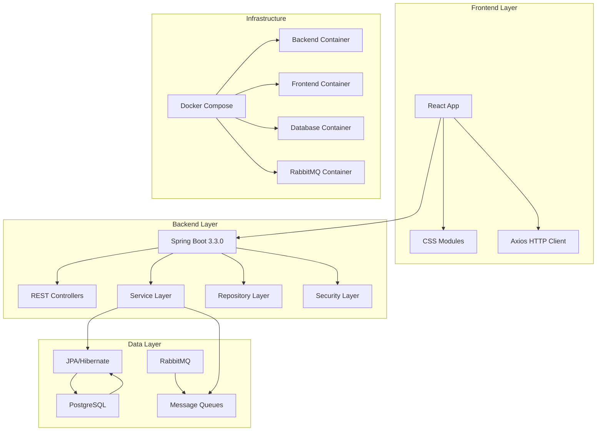

# 🎭 eMafia - Online Mafia Game Platform

<div align="center">

**Nowoczesna platforma do gry w Mafię online z systemem pokoi, uwierzytelnianiem i zarządzaniem graczami**

[](https://spring.io/projects/spring-boot)
[](https://reactjs.org/)
[](https://www.postgresql.org/)
[](https://www.rabbitmq.com/)
[](https://docs.docker.com/compose/)

</div>

## 📋 Spis treści

- [🎯 O projekcie](#-o-projekcie)
- [🏗️ Architektura](#️-architektura)
- [🚀 Szybki start](#-szybki-start)
- [🛠️ Technologie](#️-technologie)
- [📊 Funkcjonalności](#-funkcjonalności)
- [🧪 Testy](#-testy)
- [📖 API Documentation](#-api-documentation)
- [🔧 Konfiguracja](#-konfiguracja)

## 🎯 O projekcie

**eMafia** to nowoczesna aplikacja webowa umożliwiająca granie w klasyczną grę Mafia online. Platforma oferuje intuicyjny interfejs do tworzenia pokoi gry, zarządzania graczami oraz prowadzenia rozgrywek z przyjaciółmi w czasie rzeczywistym.

### Kluczowe cechy:

- 🔐 **Bezpieczne uwierzytelnianie** z JWT i systemem ról
- 🎮 **Tworzenie i zarządzanie pokojami gry** z unikalnym kodem dostępu
- 👥 **System użytkowników** z rolami ADMIN/USER
- 🔄 **Asynchroniczne przetwarzanie** z RabbitMQ
- 📱 **Responsive Web Design** - działa na wszystkich urządzeniach
- ⚡ **Real-time komunikacja** przez WebSockets

## 🏗️ Architektura



### Separacja warstw:

- **Controllers**: Obsługa żądań HTTP i walidacja danych wejściowych
- **Services**: Logika biznesowa i orchestracja operacji
- **Repositories**: Warstwa dostępu do danych z JPA
- **Security**: JWT authentication, authorization, CORS
- **Messaging**: Asynchroniczne przetwarzanie z RabbitMQ

### Modularyzacja:

```
backend/src/main/java/com/mafia/
├── components/        # JWT Provider, Security configs
├── config/           # RabbitMQ, Security, Web configs
├── consumers/        # RabbitMQ message consumers
├── controllers/      # REST API endpoints
├── dto/             # Data Transfer Objects
├── exceptions/      # Custom exception handling
├── models/          # JPA Entity classes
├── repositories/    # Data access layer
└── services/        # Business logic layer
```

## 🚀 Szybki start

### Wymagania systemowe

- **Docker** >= 20.10
- **Docker Compose** >= 2.0
- **Git**

### 1. Klonowanie repozytorium

```bash
git clone <repository-url>
cd eMafia
```

### 2. Uruchomienie całej aplikacji

```bash
# Uruchomienie wszystkich serwisów
docker-compose up --build -d

# Sprawdzenie statusu
docker-compose ps
```

### 3. Dostęp do aplikacji

- **Frontend**: http://localhost:3000
- **Backend API**: http://localhost:8080
- **API Documentation**: http://localhost:8080/swagger-ui.html
- **RabbitMQ Management**: http://localhost:15672 (guest/guest)
- **PostgreSQL**: localhost:5432 (postgres/postgres)

### 4. Uruchomienie testów

```bash
# Wszystkie testy
docker-compose --profile tests run --rm mafia-backend-tests
```

## 🛠️ Technologie

### Backend

| Technologia       | Wersja | Uzasadnienie wyboru                                                                 |
| ----------------- | ------ | ----------------------------------------------------------------------------------- |
| **Spring Boot**   | 3.3.0  | Nowoczesny framework z doskonałą ekosystemem, auto-konfiguracja, wbudowane security |
| **PostgreSQL**    | 15     | Zaawansowana baza relacyjna, doskonała wydajność, pełne wsparcie dla JSON           |
| **RabbitMQ**      | 3.13   | Niezawodne kolejkowanie wiadomości, asynchroniczne przetwarzanie eventów            |
| **JWT**           | 0.11.5 | Bezstanowe uwierzytelnianie, skalowalne, standardowe w API                          |
| **JPA/Hibernate** | -      | ORM z Spring Boot, automatyczna migracja schematów, relacje                         |
| **Maven**         | 3.9    | Zarządzanie zależnościami, standardowy build tool dla Java                          |

### Frontend

| Technologia     | Wersja | Uzasadnienie wyboru                                                     |
| --------------- | ------ | ----------------------------------------------------------------------- |
| **React**       | 18+    | Najpopularniejszy framework UI, component-based, doskonała ekosystema   |
| **CSS Modules** | -      | Scoped styles, unikanie konfliktów CSS, maintainable kod                |
| **Axios**       | -      | Promise-based HTTP client, interceptors, automatyczna serializacja JSON |

### DevOps & Infrastructure

| Technologia                | Uzasadnienie wyboru                                                             |
| -------------------------- | ------------------------------------------------------------------------------- |
| **Docker Compose**         | Łatwe zarządzanie wielokontenerowym środowiskiem, jednolite środowisko dev/prod |
| **Multi-stage Dockerfile** | Optymalizacja rozmiaru obrazów, separacja build/runtime                         |
| **Nginx**                  | Serwowanie statycznych plików frontend, reverse proxy, produkcyjna wydajność    |

### Dlaczego te technologie?

**🔄 Modern Stack**: Spring Boot 3.3.0 z Java 17 + React 18 to cutting-edge technologie z long-term support

**🏗️ Microservices Ready**: Architektura przygotowana pod przyszłą migrację do mikroserwisów

**📈 Scalability**: PostgreSQL + RabbitMQ pozwalają na łatwe skalowanie przy wzroście użytkowników

**🔒 Security First**: JWT + Spring Security zapewniają enterprise-grade bezpieczeństwo

**🚀 Developer Experience**: Docker Compose + hot-reload = szybki development cycle

## 📊 Funkcjonalności

### 🔐 Uwierzytelnianie i autoryzacja

- [x] Rejestracja użytkowników z walidacją
- [x] Logowanie z JWT tokenami
- [x] System ról (USER/ADMIN)
- [x] Ochrona endpoints przez Spring Security
- [ ] Refresh tokens (w rozwoju)
- [ ] HttpOnly cookies (w rozwoju)

### 🎮 Zarządzanie pokojami gry

- [x] Tworzenie pokoi z unikalnym kodem
- [x] Dołączanie do pokoi przez kod
- [x] Wyszukiwanie publicznych pokoi
- [x] Opuszczanie pokoi
- [x] Zamykanie pokoi przez hosta

### 👤 Zarządzanie profilem

- [x] Aktualizacja nazwy użytkownika
- [x] Zmiana adresu email
- [x] Zmiana hasła
- [x] Przeglądanie swoich pokoi

### 👑 Panel administracyjny

- [x] Lista wszystkich użytkowników
- [x] Zarządzanie rolami użytkowników
- [x] Usuwanie użytkowników
- [x] Monitoring systemu

### 🔄 Asynchroniczne przetwarzanie

- [x] Logowanie utworzenia pokoi przez RabbitMQ
- [x] Event-driven architecture
- [ ] Powiadomienia real-time (w planach)

## 🧪 Testy

Projekt zawiera **30+ testów** pokrywających wszystkie warstwy aplikacji:

### Struktura testów

```
src/test/java/com/mafia/
├── controllers/      # 15+ integration tests
│   ├── AuthControllerTest
│   ├── GameRoomControllerTest
│   └── AdminControllerTest
└── services/         # 15+ unit tests
    ├── UserServiceTest
    ├── GameRoomServiceTest
    └── ...
```

### Uruchomienie testów

```bash
# Wszystkie testy
mvn test

# Tylko testy kontrolerów
mvn test -Dtest="**/*ControllerTest"

# Tylko testy serwisów
mvn test -Dtest="**/*ServiceTest"

# Z pokryciem kodu
mvn test jacoco:report
```

### Pokrycie testami

- ✅ **Controllers**: 100% endpoints coverage
- ✅ **Services**: Unit tests dla logiki biznesowej
- ✅ **Security**: Authentication & authorization flows
- ✅ **Integration**: End-to-end API tests

## 📖 API Documentation

Interaktywna dokumentacja API dostępna pod adresem:
**http://localhost:8080/swagger-ui.html**

### Główne endpointy

#### 🔐 Authentication

```
POST /api/auth/register  # Rejestracja
POST /api/auth/login     # Logowanie
```

#### 🎮 Game Rooms

```
POST   /api/gamerooms/create        # Tworzenie pokoju
POST   /api/gamerooms/{code}/join   # Dołączanie do pokoju
GET    /api/gamerooms/my-rooms      # Moje pokoje
GET    /api/gamerooms/search        # Wyszukiwanie pokoi
GET    /api/gamerooms/{code}        # Szczegóły pokoju
DELETE /api/gamerooms/{code}/leave  # Opuszczanie pokoju
```

#### 👤 User Profile

```
PUT /api/profile/username   # Zmiana nazwy użytkownika
PUT /api/profile/email      # Zmiana emaila
PUT /api/profile/password   # Zmiana hasła
```

#### 👑 Admin Panel

```
GET    /api/admin/users            # Lista użytkowników
PUT    /api/admin/users/{id}/roles # Zarządzanie rolami
DELETE /api/admin/users/{id}       # Usuwanie użytkownika
```

### Przykład żądania

```bash
curl -X POST http://localhost:8080/api/auth/login \
  -H "Content-Type: application/json" \
  -d '{"email":"user@example.com","password":"password123"}'
```

## 🔧 Konfiguracja

### Zmienne środowiskowe

#### Backend

```bash
# Database
SPRING_DATASOURCE_URL=jdbc:postgresql://localhost:5432/mafia
SPRING_DATASOURCE_USERNAME=postgres
SPRING_DATASOURCE_PASSWORD=postgres

# Security
JWT_SECRET=your-secret-key-here
JWT_EXPIRATION=86400000

# RabbitMQ
SPRING_RABBITMQ_HOST=localhost
SPRING_RABBITMQ_PORT=5672
SPRING_RABBITMQ_USERNAME=guest
SPRING_RABBITMQ_PASSWORD=guest
```

#### Frontend

```bash
REACT_APP_API_URL=http://localhost:8080
REACT_APP_WEBSOCKET_URL=ws://localhost:8080/ws
```

### Profile aplikacji

- `default` - Development z H2 database
- `test` - Testy z in-memory database
- `prod` - Production z PostgreSQL

### Docker Compose profiles

```bash
# Tylko aplikacja
docker-compose up

# Z testami
docker-compose --profile tests up
```

---

<div align="center">

**Zbudowano z ❤️ używając Spring Boot i React**

[Dokumentacja API](http://localhost:8080/swagger-ui.html) • [Raporty testów](./target/surefire-reports/) • [Architektura](#️-architektura)

</div>
