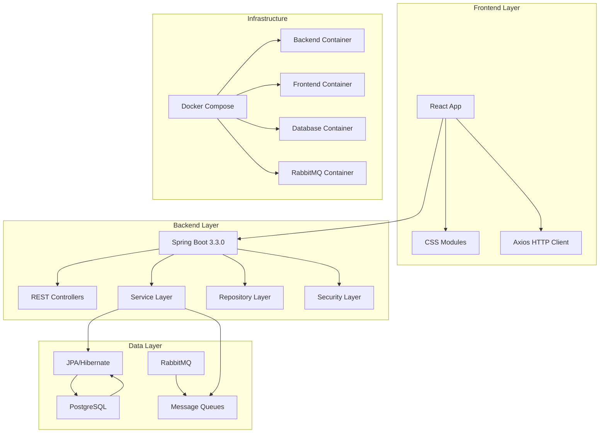
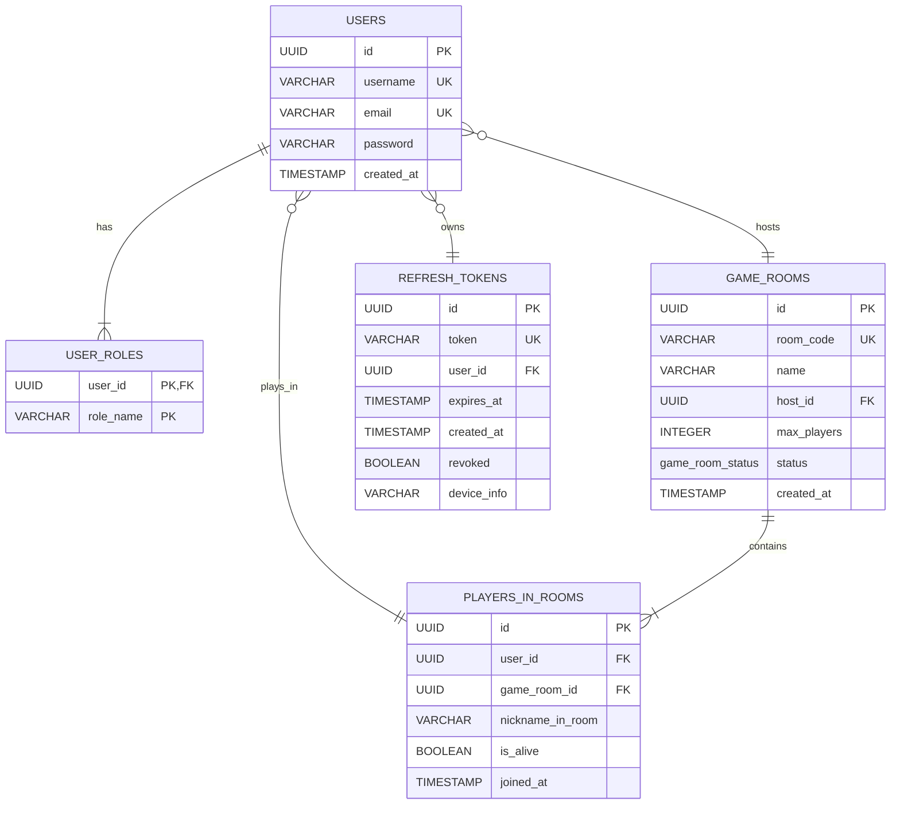

# 🎭 eMafia - Online Mafia Game Platform

<div align="center">

**A modern online Mafia game platform with a room system, authentication, and player management.**

[](https://spring.io/projects/spring-boot)
[](https://reactjs.org/)
[](https://www.postgresql.org/)
[](https://www.rabbitmq.com/)
[](https://docs.docker.com/compose/)

</div>

## 📋 Table of Contents

- [🎯 About The Project](#-about-the-project)
- [🏗️ Architecture](#️-architecture)
  - [High-Level Overview](#high-level-overview)
  - [Database Schema (ERD)](#database-schema-erd)
  - [Layer Separation](#layer-separation)
  - [Modularization (Backend)](#modularization-backend)
- [🚀 Quick Start](#-quick-start)
  - [Prerequisites](#prerequisites)
  - [Cloning the Repository](#1-cloning-the-repository)
  - [Running The Entire Application](#2-running-the-entire-application)
  - [Accessing The Application](#3-accessing-the-application)
  - [Running Tests (via Docker Compose)](#4-running-tests-via-docker-compose)
- [🛠️ Tech Stack](#️-tech-stack)
  - [Backend](#backend)
  - [Frontend](#frontend)
  - [DevOps & Infrastructure](#devops--infrastructure)
  - [Why This Stack?](#why-this-stack)
- [📊 Features](#-features)
  - [Authentication & Authorization](#-authentication--authorization)
  - [Game Room Management](#-game-room-management)
  - [User Profile Management](#-user-profile-management)
  - [Admin Panel](#-admin-panel)
  - [Asynchronous Processing](#-asynchronous-processing)
- [🧪 Testing](#-testing)
  - [Test Structure](#test-structure)
  - [Running Tests Locally (Maven)](#running-tests-locally-maven)
  - [Test Coverage Highlights](#test-coverage-highlights)
- [📖 API Documentation](#-api-documentation)
  - [Accessing Swagger UI](#accessing-swagger-ui)
  - [Main Endpoints](#main-endpoints)
  - [Example Request](#example-request)
- [🔧 Configuration](#-configuration)
  - [Environment Variables](#environment-variables)
  - [Application Profiles](#application-profiles)
  - [Docker Compose Profiles](#docker-compose-profiles)

## 🎯 About The Project

**eMafia** is a contemporary web application designed for playing the classic Mafia game online. The platform provides an intuitive interface for creating game rooms, managing players, and engaging in real-time gameplay with friends.

### Key Features:

- 🔐 **Secure Authentication**: Robust JWT-based authentication and role-based access control (USER/ADMIN).
- 🎮 **Game Room Management**: Create and manage game rooms with unique access codes.
- 👥 **User System**: Comprehensive user management with distinct roles.
- 🔄 **Asynchronous Processing**: Leverages RabbitMQ for event-driven architecture and non-blocking operations.
- 📱 **Responsive Web Design**: Ensures a seamless experience across all devices.
- ⚡ **Real-time Communication**: Utilizes WebSockets for instant updates and interactions during gameplay.

## 🏗️ Architecture

### High-Level Overview



### Database Schema (ERD)



*Note: `game_room_status` is an ENUM ('WAITING_FOR_PLAYERS', 'IN_PROGRESS', 'FINISHED', 'ABANDONED'). `USER_ROLES` represents the roles assigned to a user (e.g., 'ROLE_USER', 'ROLE_ADMIN').*

### Layer Separation (Backend):

-   **Controllers**: Handle HTTP requests, input validation, and delegate to services.
-   **Services**: Contain business logic and orchestrate operations.
-   **Repositories**: Data access layer using Spring Data JPA.
-   **Security**: JWT-based authentication, authorization, CORS configuration.
-   **Messaging**: Asynchronous event processing via RabbitMQ.

### Modularization (Backend):

The backend follows a feature-driven package structure:
```
backend/src/main/java/com/mafia/
├── components/        # JWT Provider, Security utility components
├── config/           # RabbitMQ, Security, Web configurations
├── consumers/        # RabbitMQ message consumers
├── controllers/      # REST API endpoints
├── dto/             # Data Transfer Objects
├── exceptions/      # Custom exception classes and global handler
├── models/          # JPA Entity classes
├── repositories/    # Spring Data JPA repositories
└── services/        # Business logic layer
```

## 🚀 Quick Start

### Prerequisites

-   **Docker** >= 20.10
-   **Docker Compose** >= 2.0
-   **Git**

### 1. Cloning the Repository

```bash
git clone https://github.com/balicz3k/eMafia.git
cd eMafia
```

### 2. Running The Entire Application

This command will build the images (if they don't exist or if changes are detected) and start all services in detached mode.

```bash
# Start all services defined in docker-compose.yml
docker-compose up --build -d

# Check the status of the containers
docker-compose ps
```

### 3. Accessing The Application

Once the services are up and running:

-   **Frontend Application**: [http://localhost:3000](http://localhost:3000)
-   **Backend API**: [http://localhost:8080](http://localhost:8080)
-   **API Documentation (Swagger UI)**: [http://localhost:8080/swagger-ui.html](http://localhost:8080/swagger-ui.html)
-   **RabbitMQ Management Console**: [http://localhost:15672](http://localhost:15672) (Credentials: guest/guest)
-   **PostgreSQL Database**: Connect via `localhost:5432` (Database: `mafia`, User: `postgres`, Password: `postgres`)

### 4. Running Tests (via Docker Compose)

The project is configured to run backend tests in a dedicated Docker container using a specific profile.

```bash
# Run all backend tests
docker-compose --profile tests run --rm mafia-backend-tests
```
This command utilizes the `tester_base` stage from the backend Dockerfile and the `test` Spring profile.

## 🛠️ Tech Stack

### Backend

| Technology        | Version | Rationale                                                                  |
| ----------------- | ------- | -------------------------------------------------------------------------- |
| **Spring Boot**   | 3.3.0   | Modern framework with a rich ecosystem, auto-configuration, built-in security. |
| **Java**          | 17      | LTS version, modern language features.                                     |
| **PostgreSQL**    | 15      | Advanced relational database, excellent performance, full JSON support.      |
| **RabbitMQ**      | 3.13    | Reliable message queuing for asynchronous event processing.                |
| **JWT (jjwt)**    | 0.11.5  | Stateless, scalable, and standard for API authentication.                  |
| **JPA/Hibernate** | -       | ORM with Spring Boot, schema management, relationship mapping.             |
| **Maven**         | 3.9     | Dependency management and standard build tool for Java projects.           |

### Frontend

| Technology      | Version | Rationale                                                              |
| --------------- | ------- | ---------------------------------------------------------------------- |
| **React**       | 18+     | Leading UI library, component-based architecture, vast ecosystem.        |
| **CSS Modules** | -       | Scoped styles, preventing CSS conflicts, promoting maintainable code.    |
| **Axios**       | -       | Promise-based HTTP client, interceptors, automatic JSON serialization. |

### DevOps & Infrastructure

| Technology                 | Rationale                                                                      |
| -------------------------- | ------------------------------------------------------------------------------ |
| **Docker Compose**         | Easy management of multi-container environments, consistent dev/prod setup.    |
| **Multi-stage Dockerfile** | Optimized image sizes, separation of build and runtime environments.           |
| **Nginx**                  | Serving frontend static files, reverse proxy capabilities, production-grade.   |

### Why This Stack?

-   **🔄 Modern & Robust**: Spring Boot 3.3 (Java 17) + React 18 offers cutting-edge technologies with long-term support.
-   **🏗️ Microservices Ready**: The architecture is designed with future scalability towards microservices in mind.
-   **📈 Scalability**: PostgreSQL and RabbitMQ provide a solid foundation for handling user growth and increased load.
-   **🔒 Security First**: Spring Security and JWT ensure enterprise-grade security for authentication and authorization.
-   **🚀 Developer Experience**: Docker Compose, multi-stage Dockerfiles, and features like hot-reloading (for frontend) contribute to an efficient development cycle.

## 📊 Features

### 🔐 Authentication & Authorization

-   [x] User registration with input validation.
-   [x] Secure login with JWT (Access & Refresh Tokens).
-   [x] Role-based access control (USER/ADMIN).
-   [x] Endpoint protection via Spring Security.
-   [x] Refresh token mechanism for extended sessions.
-   [ ] HttpOnly cookies for enhanced token security (Planned).

### 🎮 Game Room Management

-   [x] Create game rooms with unique, shareable codes.
-   [x] Join existing rooms using their codes.
-   [x] Search for public game rooms.
-   [x] Leave game rooms.
-   [x] Room closure by the host.
-   [x] Real-time player list updates.
-   [ ] Game state management (e.g., night/day phases, voting).

### 👤 User Profile Management

-   [x] Update username.
-   [x] Change email address.
-   [x] Securely update password.
-   [x] View a list of rooms the user is part of or has hosted.

### 👑 Admin Panel

-   [x] View a list of all registered users.
-   [x] Manage user roles (promote/demote).
-   [x] Delete users.
-   [ ] System monitoring and statistics (Planned).

### 🔄 Asynchronous Processing

-   [x] Logging of room creation events via RabbitMQ.
-   [x] Foundation for an event-driven architecture.
-   [ ] Real-time notifications using WebSockets and RabbitMQ (Planned).

## 🧪 Testing

The project includes an extensive test suite (30+ tests) covering various layers of the backend application.

### Test Structure (Backend)

```
src/test/java/com/mafia/
├── controllers/      # Integration tests for REST API endpoints (e.g., AuthControllerTest)
├── services/         # Unit tests for business logic (e.g., UserServiceTest)
└── integration/      # End-to-end integration tests (e.g., AuthIntegrationTest)
```

### Running Tests Locally (Maven)

For local development and CI, you can run tests using Maven:

```bash
# Run all tests
mvn test

# Run only controller tests
mvn test -Dtest="**/*ControllerTest"

# Run only service tests
mvn test -Dtest="**/*ServiceTest"

# Run tests and generate a code coverage report (Jacoco)
mvn test jacoco:report
```
*Ensure you have a local PostgreSQL and RabbitMQ instance running or configure the `application-test.properties` for an in-memory database like H2 if preferred for certain local test runs.*

### Test Coverage Highlights

-   ✅ **Controllers**: High endpoint coverage for REST APIs.
-   ✅ **Services**: Comprehensive unit tests for core business logic.
-   ✅ **Security**: Tests for authentication and authorization flows.
-   ✅ **Integration**: End-to-end tests verifying interactions between components.

## 📖 API Documentation

### Accessing Swagger UI

Interactive API documentation is available via Swagger UI when the backend application is running:
**[http://localhost:8080/swagger-ui.html](http://localhost:8080/swagger-ui.html)**

### Main Endpoints

#### 🔐 Authentication

```
POST /api/auth/register     # Register a new user
POST /api/auth/login        # Log in an existing user
POST /api/auth/refresh      # Refresh an access token
POST /api/auth/logout       # Log out the current user (revokes refresh token)
POST /api/auth/logout-all   # Log out from all devices (revokes all user's refresh tokens)
```

#### 🎮 Game Rooms

```
POST   /api/gamerooms/create        # Create a new game room
POST   /api/gamerooms/{code}/join   # Join an existing game room
GET    /api/gamerooms/my-rooms      # Get rooms associated with the current user
GET    /api/gamerooms/search        # Search for game rooms by name
GET    /api/gamerooms/{code}        # Get details of a specific game room
POST   /api/gamerooms/{code}/leave  # Leave a game room
POST   /api/gamerooms/{code}/end    # End a game room (host only)
```

#### 👤 User Profile & Management

```
GET    /api/users/search             # Search for users by username
PUT    /api/users/profile/username   # Update current user's username
PUT    /api/users/profile/email      # Update current user's email
PUT    /api/users/profile/password   # Update current user's password
```

#### 👑 Admin Panel

```
GET    /api/admin/users            # Get a list of all users
PUT    /api/admin/users/{id}/roles # Update roles for a specific user
DELETE /api/admin/users/{id}       # Delete a user
```

### Example Request (Login)

```bash
curl -X POST http://localhost:8080/api/auth/login \
  -H "Content-Type: application/json" \
  -d '{"email":"user@example.com","password":"password123"}'
```

## 🔧 Configuration

### Environment Variables

Key environment variables for configuring the application (primarily for Docker deployment). For local development outside Docker, these can be set in `application.properties`.

#### Backend (within `docker-compose.yml` or system environment)

```bash
# Database (when running in Docker, 'db' is the service name)
SPRING_DATASOURCE_URL=jdbc:postgresql://db:5432/mafia
SPRING_DATASOURCE_USERNAME=postgres
SPRING_DATASOURCE_PASSWORD=postgres

# Security
JWT_SECRET=your-very-strong-secret-key-here-at-least-256-bits
JWT_EXPIRATION=3600000 # Access token expiration in milliseconds (e.g., 1 hour)
JWT_REFRESH_EXPIRATION=604800000 # Refresh token expiration (e.g., 7 days)

# RabbitMQ (when running in Docker, 'rabbitmq' is the service name)
SPRING_RABBITMQ_HOST=rabbitmq
SPRING_RABBITMQ_PORT=5672
SPRING_RABBITMQ_USERNAME=guest
SPRING_RABBITMQ_PASSWORD=guest
```
*Note: `application.properties` contains default values which might be suitable for local development outside Docker (e.g., `SPRING_DATASOURCE_URL=jdbc:postgresql://localhost:5432/mafia`).*

#### Frontend (typically in a `.env` file for React)

```bash
REACT_APP_API_URL=http://localhost:8080
REACT_APP_WEBSOCKET_URL=ws://localhost:8080/ws
```

### Application Profiles (Spring Boot)

-   `default`: Active by default. Uses settings from `application.properties` (typically for development with local PostgreSQL).
-   `test`: Used for running tests. Configured in `application-test.properties` (e.g., uses H2 in-memory database, disables RabbitMQ auto-configuration).
-   `prod`: Intended for production deployments (configuration would typically be externalized or use different property files).

### Docker Compose Profiles

-   **default services**: Running `docker-compose up` starts the main application services (backend, frontend, db, rabbitmq).
-   **`tests` profile**: Running `docker-compose --profile tests up` (or `run`) includes services specifically for running tests, like `mafia-backend-tests`.

---

<div align="center">

**Built with ❤️ using Spring Boot & React**

[API Documentation](#-api-documentation) • [Architecture Overview](#️-architecture)

</div>